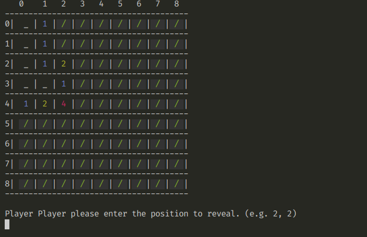

# Minesweeper

- A simple console version of the Microsoft minesweeper game

## Starting the Minesweeper
- `ruby Game.rb` if with out a minesweeper_1.txt puzzle file
- `ruby Game.rb [puzzle file]` with other puzzle file format similar to minesweeper 9x9 grid form

## Dependecy
- [colorize gem !](https://github.com/fazibear/colorize)
